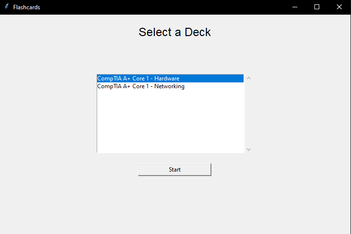
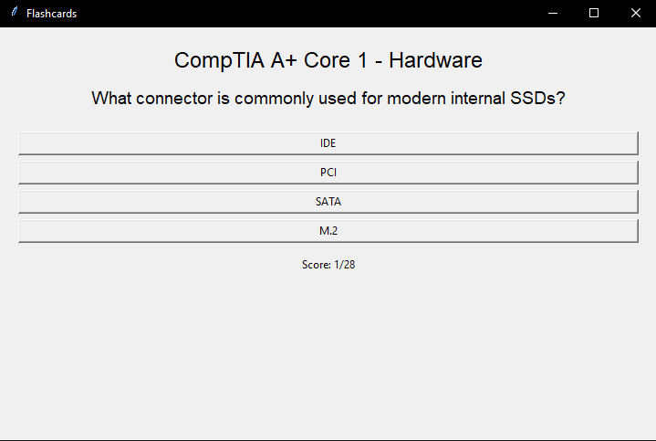
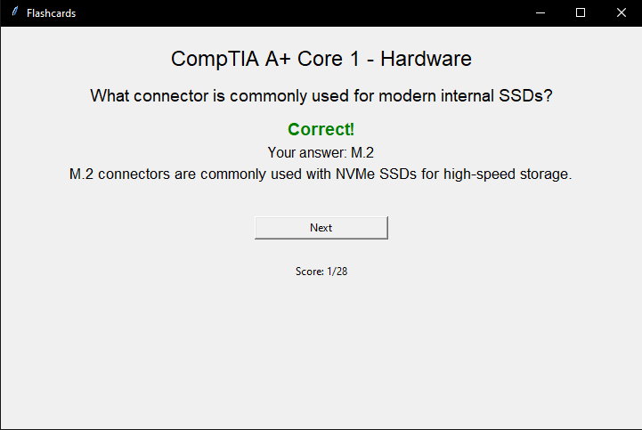

# Flashcards – Study App (Python)

A small desktop flashcard app built with Python + Tkinter for CompTIA or Similar certification study.

## Features
- Loads decks from JSON files
- Deck selector (scrollable)
- Randomizes question order and answer order
- Shows correct/incorrect + explanation
- Score shown as `Score: X / Total`
- Redo missed questions as a separate quiz

## Requirements
- Python 3.9+ (no external libraries)

## Screenshots

### Deck Selection

### Question View

### Explanation View
